# Entity-relationship diagram

Generated from [`../migrations/0001_core_schema.sql`](../migrations/0001_core_schema.sql) and
[`../migrations/0003_users_and_permission_profiles.sql`](../migrations/0003_users_and_permission_profiles.sql) and
[`../migrations/0004_data_model_admin.sql`](../migrations/0004_data_model_admin.sql) and
[`../migrations/0005_ui_settings.sql`](../migrations/0005_ui_settings.sql)
(`sessions.ip_address` from [`../migrations/0006_auth_audit.sql`](../migrations/0006_auth_audit.sql)).
Update this diagram in the same pull request as any migration that adds, removes or re-links a table.
Column-level rules and triggers are described in [`docs/data-model.md`](../../docs/data-model.md).

```mermaid
erDiagram
    ci_classes ||--o{ ci_classes : "parent_id"
    ci_classes ||--o{ ci_attribute_definitions : "class_id"
    ci_classes |o--o{ ci_attribute_definitions : "reference_class_id"
    ci_classes ||--o{ configuration_items : "class_id"
    ci_classes ||--o{ relationship_type_rules : "source_class_id"
    ci_classes ||--o{ relationship_type_rules : "target_class_id"

    configuration_items ||--o{ ci_attribute_values : "ci_id"
    ci_attribute_definitions ||--o{ ci_attribute_values : "attribute_id"
    configuration_items |o--o{ ci_attribute_values : "value_ref_ci_id"
    lookup_lists |o--o{ ci_attribute_definitions : "lookup_list_id"
    lookup_lists ||--o{ lookup_list_values : "list_id"
    lookup_list_values |o--o{ ci_attribute_values : "value_lookup_id"

    relationship_types ||--o{ relationship_type_rules : "relationship_type_id"
    relationship_types ||--o{ ci_relationships : "relationship_type_id"
    configuration_items ||--o{ ci_relationships : "source_ci_id"
    configuration_items ||--o{ ci_relationships : "target_ci_id"

    statuses ||--o{ configuration_items : "status_id"
    environments |o--o{ configuration_items : "environment_id"
    owners |o--o{ configuration_items : "owner_id"
    locations |o--o{ configuration_items : "location_id"
    locations |o--o{ locations : "parent_id"

    users ||--o{ user_permission_profiles : "user_id"
    permission_profiles ||--o{ user_permission_profiles : "profile_id"
    permission_profiles ||--o{ permission_profile_global_permissions : "profile_id"
    permission_profiles ||--o{ permission_profile_class_permissions : "profile_id"
    ci_classes |o--o{ permission_profile_class_permissions : "class_id (NULL = all classes)"
    users ||--o{ sessions : "user_id"
    ui_settings_versions ||--o| ui_settings : "version (current)"

    ci_classes {
        uuid id PK
        text key UK
        text name
        uuid parent_id FK
        boolean is_abstract
        text color
        integer sort_order
        boolean is_active
    }
    ci_attribute_definitions {
        uuid id PK
        uuid class_id FK
        text key
        text data_type
        boolean is_required
        jsonb enum_values
        uuid reference_class_id FK
        uuid lookup_list_id FK
        text group_name
        text help_text
        jsonb default_value
    }
    lookup_lists {
        uuid id PK
        text key UK
        text name
        boolean is_active
    }
    lookup_list_values {
        uuid id PK
        uuid list_id FK
        text key
        text name
        text color
        boolean is_active
    }
    configuration_items {
        uuid id PK
        uuid class_id FK
        text name
        uuid status_id FK
        uuid environment_id FK
        uuid owner_id FK
        uuid location_id FK
        text hostname
        inet ip_address
        text serial_number
        integer version
        timestamptz deleted_at
        tsvector search_vector
    }
    ci_attribute_values {
        uuid id PK
        uuid ci_id FK
        uuid attribute_id FK
        text value_text
        numeric value_number
        boolean value_boolean
        date value_date
        timestamptz value_datetime
        inet value_ip
        cidr value_cidr
        uuid value_ref_ci_id FK
        uuid value_lookup_id FK
    }
    relationship_types {
        uuid id PK
        text key UK
        text forward_label
        text reverse_label
        boolean is_directional
    }
    relationship_type_rules {
        uuid id PK
        uuid relationship_type_id FK
        uuid source_class_id FK
        uuid target_class_id FK
    }
    ci_relationships {
        uuid id PK
        uuid relationship_type_id FK
        uuid source_ci_id FK
        uuid target_ci_id FK
        timestamptz deleted_at
    }
    statuses {
        uuid id PK
        text key UK
        boolean is_operational
    }
    environments {
        uuid id PK
        text key UK
    }
    owners {
        uuid id PK
        text kind
        text name
        text email
        text external_ref UK
    }
    locations {
        uuid id PK
        text key UK
        uuid parent_id FK
        text location_type
    }
    audit_log {
        bigint id PK
        timestamptz occurred_at
        text actor_type
        text action
        text entity_type
        uuid entity_id
        jsonb old_value
        jsonb new_value
    }
    users {
        uuid id PK
        text username UK "unique lower(username)"
        text display_name
        text email
        text password_hash "argon2id"
        boolean is_active
        timestamptz last_login_at
    }
    permission_profiles {
        uuid id PK
        text name UK "unique lower(name)"
        boolean is_builtin "Administrator"
    }
    permission_profile_global_permissions {
        uuid profile_id PK,FK
        text permission PK
    }
    permission_profile_class_permissions {
        uuid id PK
        uuid profile_id FK
        uuid class_id FK "NULL = all classes"
        boolean can_view
        boolean can_create
        boolean can_edit
        boolean can_delete
    }
    user_permission_profiles {
        uuid user_id PK,FK
        uuid profile_id PK,FK
    }
    sessions {
        uuid id PK
        bytea token_hash UK "sha256 of the cookie"
        uuid user_id FK
        text csrf_token
        timestamptz last_seen_at
        timestamptz expires_at
        inet ip_address "client address at sign-in"
    }
    ui_settings {
        uuid id PK
        boolean singleton UK "always true: one row"
        int version FK
        jsonb settings "UiSettingsDocument, references by key"
        text updated_by_name
    }
    ui_settings_versions {
        int version PK
        jsonb settings
        text actor_type
        text actor_name
        text comment
    }
    ui_assets {
        uuid id PK
        text kind UK "logo | favicon"
        text content_type
        bytea data
        text sha256 "ETag"
    }
```

`audit_log` has no foreign keys by design: `entity_type` + `entity_id` point at a row in any table,
and the log is append-only (UPDATE and DELETE are rejected by a trigger). `actor_id` holds the acting
user's id as text, without a foreign key, so deleting a user never touches history.
