# Entity-relationship diagram

Generated from [`../migrations/0001_core_schema.sql`](../migrations/0001_core_schema.sql) and
[`../migrations/0003_users_and_permission_profiles.sql`](../migrations/0003_users_and_permission_profiles.sql) and
[`../migrations/0004_data_model_admin.sql`](../migrations/0004_data_model_admin.sql) and
[`../migrations/0005_ui_settings.sql`](../migrations/0005_ui_settings.sql) and
[`../migrations/0008_cmdb_schema_and_areas.sql`](../migrations/0008_cmdb_schema_and_areas.sql) and
[`../migrations/0009_type_tables.sql`](../migrations/0009_type_tables.sql) and
[`../migrations/0010_api_tokens.sql`](../migrations/0010_api_tokens.sql) and
[`../migrations/0013_mfa_totp.sql`](../migrations/0013_mfa_totp.sql) and
[`../migrations/0014_enterprise_sign_in.sql`](../migrations/0014_enterprise_sign_in.sql) and
[`../migrations/0015_lookup_parent_lists.sql`](../migrations/0015_lookup_parent_lists.sql) and
[`../migrations/0016_core_ci_model.sql`](../migrations/0016_core_ci_model.sql) and
[`../migrations/0018_audit_hash_chain.sql`](../migrations/0018_audit_hash_chain.sql) and
[`../migrations/0021_stateless_oidc_start.sql`](../migrations/0021_stateless_oidc_start.sql) and
[`../migrations/0029_bulk_import.sql`](../migrations/0029_bulk_import.sql) and
[`../migrations/0039_saved_views.sql`](../migrations/0039_saved_views.sql)
(`sessions.ip_address` from [`../migrations/0006_auth_audit.sql`](../migrations/0006_auth_audit.sql); the columns
added by [`0022`](../migrations/0022_api_token_creator.sql) to [`0026`](../migrations/0026_identity_provider_secret_encryption.sql)
and [`0028`](../migrations/0028_schema_change_redaction.sql) on `api_tokens`, `identity_providers`, `sessions`,
`user_totp` and `schema_changes`).
Every table below lives in the `cmdb` schema, except the type tables: each area is a schema of its
own and each type a table in it. `area_schema__type_table` stands for one of them (e.g.
`bestand.netzwerk`); its columns other than `id` are the type's fields, created by the DDL engine.
`statuses`, `environments`, `owners` and `locations` are deprecated since 0016: no CI refers to them.
Update this diagram in the same pull request as any migration that adds, removes or re-links a table.
The tables show their key columns and those that shape a relationship or need a note, not every column;
the complete column list and the column-level rules and triggers are defined in the migrations under
[`../migrations/`](../migrations/). Timestamps such as `created_at` and
`updated_at` are left out.

```mermaid
erDiagram
    areas ||--o{ ci_classes : "area_id (the table's schema)"
    ci_classes ||--o{ ci_classes : "parent_id"
    ci_classes ||--o{ ci_attribute_definitions : "class_id"
    ci_classes |o--o{ ci_attribute_definitions : "reference_class_id"
    ci_attribute_definitions |o--o{ ci_classes : "title_attribute_id (labels the CIs)"
    ci_classes ||--o{ configuration_items : "class_id"
    ci_classes ||--o{ relationship_type_rules : "source_class_id"
    ci_classes ||--o{ relationship_type_rules : "target_class_id"

    configuration_items ||--o| area_schema__type_table : "id (PK and FK, ON DELETE CASCADE)"
    ci_classes ||--|| area_schema__type_table : "one table per type"
    ci_attribute_definitions ||--|| area_schema__type_table : "one column per field"
    configuration_items |o--o{ area_schema__type_table : "reference field (FK)"
    lookup_lists |o--o{ ci_attribute_definitions : "lookup_list_id"
    lookup_lists ||--o{ lookup_list_values : "list_id"
    lookup_lists |o--o{ lookup_lists : "parent_list_id"
    lookup_list_values |o--o{ lookup_list_values : "parent_value_id"
    ci_attribute_definitions |o--o{ ci_attribute_definitions : "parent_attribute_id"
    lookup_list_values |o--o{ area_schema__type_table : "lookup field (FK, RESTRICT)"

    relationship_types ||--o{ relationship_type_rules : "relationship_type_id"
    relationship_types ||--o{ ci_relationships : "relationship_type_id"
    configuration_items ||--o{ ci_relationships : "source_ci_id"
    configuration_items ||--o{ ci_relationships : "target_ci_id"

    locations |o--o{ locations : "parent_id"

    users ||--o{ user_permission_profiles : "user_id"
    permission_profiles ||--o{ user_permission_profiles : "profile_id"
    permission_profiles ||--o{ permission_profile_global_permissions : "profile_id"
    permission_profiles ||--o{ permission_profile_class_permissions : "profile_id"
    ci_classes |o--o{ permission_profile_class_permissions : "class_id (NULL = all classes)"
    users ||--o{ sessions : "user_id"
    users ||--o{ api_tokens : "user_id (owner, CASCADE)"
    users |o--o{ api_tokens : "created_by_user_id (SET NULL)"
    permission_profiles |o--o{ api_tokens : "profile_id (scope; SET NULL when the profile is deleted)"
    users ||--o| user_totp : "user_id (PK and FK)"
    users ||--o{ user_recovery_codes : "user_id"
    users ||--o{ mfa_challenges : "user_id"
    identity_providers |o--o{ users : "identity_provider_id (RESTRICT)"
    identity_providers ||--o{ identity_provider_group_mappings : "provider_id"
    permission_profiles ||--o{ identity_provider_group_mappings : "profile_id"
    ui_settings_versions ||--o| ui_settings : "version (current)"
    users |o--o{ import_jobs : "created_by_id (SET NULL)"
    import_jobs ||--o{ import_job_files : "job_id"
    import_jobs ||--o{ import_job_issues : "job_id"
    import_jobs ||--o{ import_idempotency_keys : "job_id"
    users |o--o{ import_mappings : "created_by_id (SET NULL)"
    users |o--o{ saved_views : "owner_id (CASCADE; NULL = shared)"
    users |o--o{ saved_views : "created_by_id, updated_by_id (SET NULL)"
    users ||--o{ saved_view_defaults : "user_id (CASCADE)"
    saved_views ||--o{ saved_view_defaults : "view_id (CASCADE)"

    areas {
        uuid id PK
        text key UK "schema name, immutable"
        text name
        text description
        text icon
        text color
        integer sort_order
        boolean is_active "false = archived"
    }
    ci_classes {
        uuid id PK
        text key UK "table name, immutable"
        text name
        text description
        text icon
        uuid area_id FK "immutable"
        uuid parent_id FK
        boolean is_abstract
        text color
        integer sort_order
        boolean is_active
        uuid title_attribute_id FK "labels the CIs; SET NULL on purge"
    }
    ci_attribute_definitions {
        uuid id PK
        uuid class_id FK "immutable"
        text key "column name, immutable"
        text label
        text description
        text data_type
        boolean is_required
        jsonb enum_values
        jsonb validation "min, max, pattern (checked by the API)"
        uuid reference_class_id FK
        uuid lookup_list_id FK
        uuid parent_attribute_id FK "lookup field on the parent list"
        text group_name
        integer sort_order
        boolean is_active
        text help_text
        jsonb default_value
    }
    lookup_lists {
        uuid id PK
        text key UK
        text name
        uuid parent_list_id FK "no cycles"
        boolean is_active
    }
    lookup_list_values {
        uuid id PK
        uuid list_id FK
        uuid parent_value_id FK "value of the parent list"
        text key
        text name
        text color
        boolean is_active
    }
    configuration_items {
        uuid id PK
        uuid class_id FK
        text ident UK "CI-7K3M9Q2X; unique regardless of case"
        timestamptz valid_from
        timestamptz valid_until "active: valid_from <= now < valid_until"
        text label "title attribute value or ident (API-maintained)"
        integer version
        timestamptz deleted_at
        tsvector search_vector "label and ident"
    }
    area_schema__type_table {
        uuid id PK,FK "configuration_items.id"
        text text_or_enum_field "enum: CHECK on the values"
        numeric number_field
        bigint integer_field
        boolean boolean_field
        date date_field
        timestamptz datetime_field
        inet ip_field
        cidr cidr_field
        uuid reference_field FK "configuration_items"
        uuid lookup_field FK "lookup_list_values"
    }
    schema_changes {
        uuid id PK
        timestamptz occurred_at
        text actor_type
        text actor_id
        text actor_name
        text request_id
        text summary
        text_array statements "the exact DDL"
        jsonb impact
        uuid_array count_classes "types the counts describe; NULL before 0028"
        text redacted_summary "the record without those counts"
        jsonb redacted_impact
    }
    relationship_types {
        uuid id PK
        text key UK
        text forward_label
        text reverse_label
        boolean is_directional
    }
    relationship_type_rules {
        uuid id PK
        uuid relationship_type_id FK
        uuid source_class_id FK
        uuid target_class_id FK
    }
    ci_relationships {
        uuid id PK
        uuid relationship_type_id FK
        uuid source_ci_id FK
        uuid target_ci_id FK
        timestamptz deleted_at
    }
    statuses {
        uuid id PK "deprecated since 0016: copied into lookup list status (same ids)"
        text key UK
        boolean is_operational
    }
    environments {
        uuid id PK
        text key UK
    }
    owners {
        uuid id PK
        text kind
        text name
        text email
        text external_ref UK
    }
    locations {
        uuid id PK
        text key UK
        uuid parent_id FK
        text location_type
    }
    audit_log {
        bigint id PK
        timestamptz occurred_at
        text actor_type
        text actor_id "user id as text, no FK"
        text actor_name
        text action
        text entity_type
        uuid entity_id
        jsonb old_value
        jsonb new_value
        text request_id
        bigint chain_seq "hash chain, 0018"
        bytea prev_hash "row_hash of the previous row"
        bytea row_hash "sha256 over prev_hash and the row"
    }
    audit_log_chain_head {
        boolean singleton PK "always true: one row"
        bigint last_seq
        bytea last_hash "the chain head"
    }
    users {
        uuid id PK
        text username UK "unique lower(username)"
        text display_name
        text email
        text password_hash "argon2id; NULL for an account of an identity provider"
        timestamptz password_changed_at
        boolean is_active
        timestamptz last_login_at
        uuid identity_provider_id FK "NULL for a local account"
        text external_id "OIDC sub or directory id; unique with the provider"
    }
    permission_profiles {
        uuid id PK
        text name UK "unique lower(name)"
        boolean is_builtin "Administrator"
        boolean require_mfa "holders must set up two-factor authentication"
    }
    permission_profile_global_permissions {
        uuid profile_id PK,FK
        text permission PK
    }
    permission_profile_class_permissions {
        uuid id PK
        uuid profile_id FK
        uuid class_id FK "NULL = all classes"
        boolean can_view
        boolean can_create
        boolean can_edit
        boolean can_delete
    }
    user_permission_profiles {
        uuid user_id PK,FK
        uuid profile_id PK,FK
    }
    sessions {
        uuid id PK
        bytea token_hash UK "sha256 of the cookie"
        uuid user_id FK
        text csrf_token
        timestamptz last_seen_at
        timestamptz expires_at
        inet ip_address "client address at sign-in"
        boolean mfa_verified "the session proved a second factor"
    }
    api_tokens {
        uuid id PK
        text name
        uuid user_id FK "owner"
        uuid profile_id FK "scope; NULL once the profile is deleted"
        bytea token_hash UK "sha256 of the secret"
        text token_prefix
        timestamptz expires_at
        timestamptz revoked_at
        text revoked_by
        timestamptz last_used_at
        inet last_used_ip
        text created_by "creator name, for display"
        uuid created_by_user_id FK "SET NULL when the creator is deleted"
        boolean mfa_verified "the creating session proved a second factor"
    }
    user_totp {
        uuid user_id PK,FK
        bytea secret "AES-256-GCM ciphertext; 20 bytes plain before 0025"
        integer key_id "NULL: secret still plain"
        timestamptz confirmed_at "NULL while set-up is unconfirmed"
        bigint last_used_step
    }
    user_recovery_codes {
        uuid id PK
        uuid user_id FK
        bytea code_hash "sha256; unique with user_id"
        timestamptz used_at
    }
    mfa_challenges {
        uuid id PK
        bytea token_hash UK "sha256 of the cookie token"
        uuid user_id FK
        timestamptz expires_at
        integer failed_attempts
    }
    identity_providers {
        uuid id PK
        text kind "oidc | ldap, immutable"
        text name "unique lower(name)"
        boolean is_enabled
        integer sort_order
        text ca_certificate "PEM"
        text issuer_url "OIDC"
        text client_id "OIDC"
        bytea client_secret_enc "OIDC, encrypted"
        text mfa_assurance "OIDC: verify | trust_provider"
        text_array required_acr "OIDC"
        text ldap_url "LDAP"
        bytea bind_password_enc "LDAP, encrypted"
        integer secrets_key_id "id of the encryption key"
    }
    identity_provider_group_mappings {
        uuid id PK
        uuid provider_id FK
        text group_name "claim value or group DN"
        uuid profile_id FK
    }
    server_keys {
        text purpose PK "e.g. oidc_state"
        smallint key_id "one byte, 0 to 255"
        bytea secret "32 bytes"
    }
    ui_settings {
        uuid id PK
        boolean singleton UK "always true: one row"
        int version FK
        jsonb settings "UiSettingsDocument, references by key"
        text updated_by_name
    }
    ui_settings_versions {
        int version PK
        jsonb settings
        text actor_type
        text actor_name
        text comment
    }
    import_settings {
        boolean id PK "always true: one row"
        boolean enabled "off after install"
    }
    import_jobs {
        uuid id PK
        uuid created_by_id FK
        text status
        text file_name
        text file_sha256
        text class_key "by key, no FK"
        jsonb mapping
        integer committed_through_row "commit cursor"
        integer lease_epoch "fencing token"
        timestamptz expires_at
    }
    import_job_files {
        uuid job_id PK,FK
        integer seq PK
        bytea data "at most 1 MiB"
    }
    import_job_issues {
        uuid job_id PK,FK
        integer seq PK
        integer row_no
        text code
        text value "shortened cell"
    }
    import_idempotency_keys {
        uuid user_id PK,FK
        text operation PK
        text key PK
        uuid job_id FK
    }
    import_mappings {
        uuid id PK
        text name UK "unique per class_key, lower(name)"
        text class_key "by key, no FK"
        jsonb definition
        integer version
    }
    saved_views {
        uuid id PK
        uuid owner_id FK "NULL = shared with every user"
        text context "inventory | search"
        text name UK "unique per owner_id, context, lower(name); shared: per context"
        text description
        jsonb definition "classes, attributes, lookups by key, no FK"
        integer version
    }
    saved_view_defaults {
        uuid user_id PK,FK
        text context PK "inventory only"
        text home PK "class key, or empty for the unscoped inventory"
        uuid view_id FK
    }
    ui_assets {
        uuid id PK
        text kind UK "logo | favicon"
        text content_type
        bytea data
        text sha256 "ETag"
    }
```

`schema_changes` is append-only like `audit_log` and, like it, has no foreign keys: it records what
ran, even for objects purged since. Each type also has a read-only reporting view `<area>.v_<type>`
(registry columns plus the fields of the type and its ancestors), not shown here.

`audit_log` has no foreign keys by design: `entity_type` + `entity_id` point at a row in any table,
and the log is append-only (UPDATE and DELETE are rejected by a trigger). `actor_id` holds the acting
user's id as text, without a foreign key, so deleting a user never touches history. Since 0018 every row
is also hash-chained: a trigger sets `chain_seq`, `prev_hash` (the previous row's `row_hash`) and `row_hash`,
and the one row of `audit_log_chain_head` holds the last sequence number and hash, so inserts are serialised
on it. Since 0040 the head is written once per transaction, at commit, by a deferred trigger, and only
those triggers write it; the API role may read it (0038), so `shadoucmdb backup` can copy it. `server_keys` has no relationships: it holds the keys the server generates for itself.
